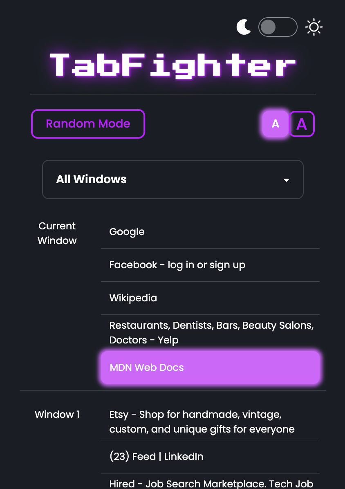
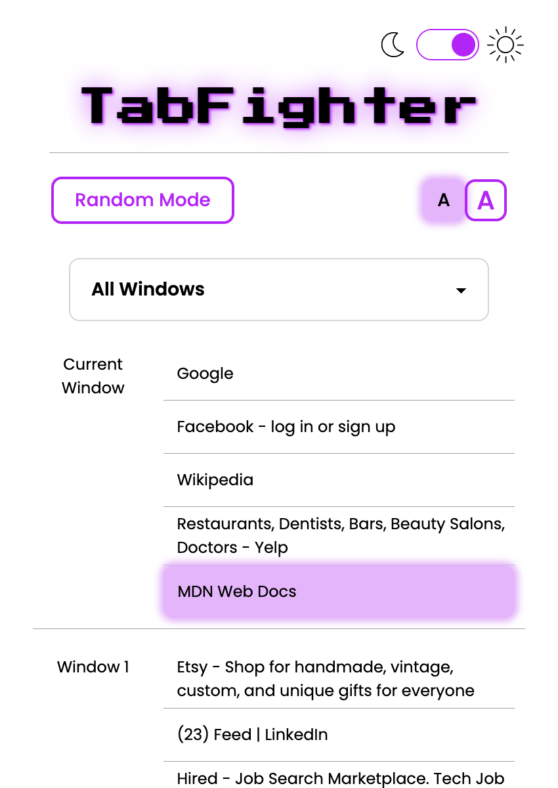
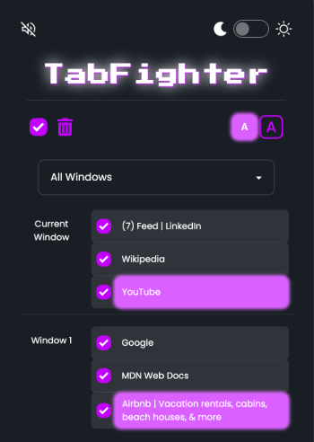
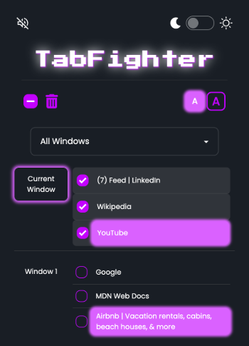
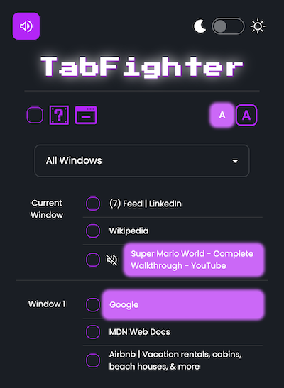
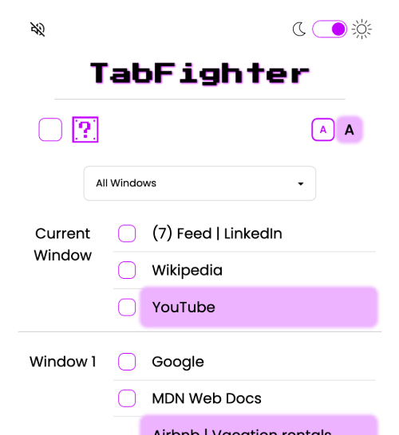

# TabFighter 2.0

## Getting started
To add TabFighter 2.0 to your Chrome Extensions:

1. Clone this repo to your local machine.
2. Bundle with Webpack by running `npm run build` in your terminal.
3. Go to `chrome://extensions` and turn on _Developer Mode_.
4. Click `Load Unpacked` and navigate to the directory you saved locally. __ONLY__ upload the `dist` folder.
5. Pin `TabFighter 2.0` to your extension bar and get fighting!

__Be sure to turn your sound on and enjoy!__

  

## Features
### View Tabs and Navigate to Tab
- Click to go any tab on any window
- View tabs on your current window at the top of the list
- Select a window from the dropdown to see only tabs on that window
### Re-order Tabs
- Drag and drop tabs to re-order your tabs in their current window or move tabs to a new window
### Close Tabs or Windows
- Select individual or select all tabs to close
- Click on the window name to select all the tabs in that window
- If you're feeling spicy, close a tab at random by hitting the Chance button
### Minimize Windows
 - Minimize all windows quickly with the click of a button
### Muting
- Easily view and mute / unmute any audible tabs
### Accessibility + more
- Accessibility feature: enlarge font size for better viewing
- Light and Dark mode
- Nostalgic sound effects

## Examples
### Themes
#### Dark Mode

#### Light Mode

### Select
#### Select All

#### Select Window

### Mute Tab

### Large Font
