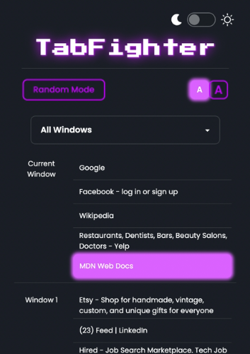
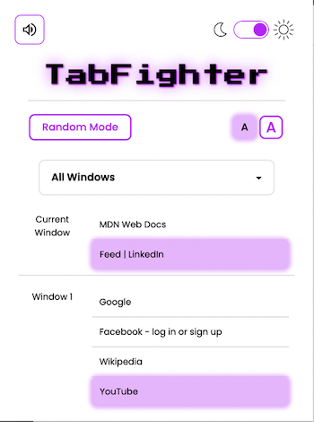
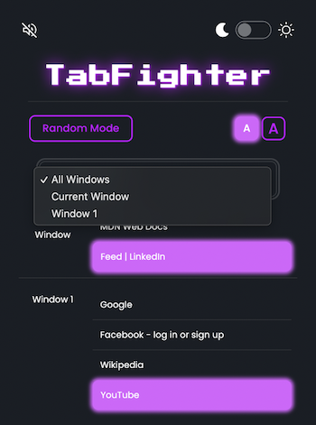
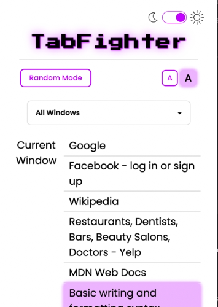

# TabFighter 2.0

## Getting started
To add TabFighter 2.0 to your Chrome Extensions:

1. Clone this repo to your local machine.
2. Bundle with Webpack by running `npm run build` in your terminal.
3. Go to `chrome://extensions` and turn on _Developer Mode_.
4. Click `Load Unpacked` and navigate to the directory you saved locally. __ONLY__ upload the `dist` folder.
5. Pin `TabFighter 2.0` to your extension bar and get fighting!

__Be sure to turn your sound on and enjoy!__

## Features
- Click to go to or close any tab on any window.
- View tabs on your current window at the top of the list.
- Select a window from the dropdown to see only tabs on that window.
- If you're feeling spicy, close a tab at random with Random Mode.
- Accessibility feature: enlarge font size for better viewing.
- Light and Dark mode!

## Examples

## Coming Soon
More themes!

  

